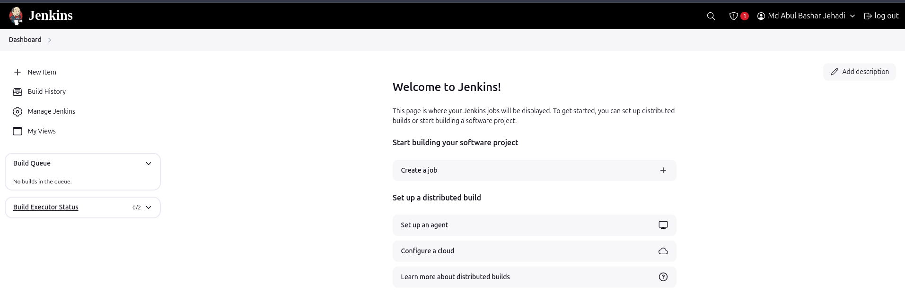

## 145. Introduction


 - What is Continuous Integration?
 - answer is Code, Build, Test & Push


## 146. Installation
 - created a EC2 instance with t2 small  because jenkins required higher memory during build job.

### Install java and jenkins

```sh
sudo apt update
sudo apt install fontconfig openjdk-17-jre
java -version
sudo wget -O /usr/share/keyrings/jenkins-keyring.asc \
  https://pkg.jenkins.io/debian-stable/jenkins.io-2023.key
echo "deb [signed-by=/usr/share/keyrings/jenkins-keyring.asc]" \
  https://pkg.jenkins.io/debian-stable binary/ | sudo tee \
  /etc/apt/sources.list.d/jenkins.list > /dev/null
sudo apt-get update
sudo apt-get install jenkins

```
### Home directory of jenkins where it will store all the data except log
```sh
ls /var/lib/jenkins
for getting the intital password must need to be root
cat /var/lib/jenkins/secrets/initialAdminPassword

```



## 147. Freestyle Vs Pipeline As A Code
- Freestyle jobs mainly graphical jobs 
- Pipeline as a code where pipeline created in groovy language

## 148. Installing tools in Jenkins
- we can install tools via terminal by connecting instance where jenkins installed or we can install via manage jenkins > tools
- we installed Maven & openjdk-17-jdk

## 149. First Job
- we created first job where i run those commands in Execute Shell
```sh
whoami
pwd
w
id
```
## 150. First Build Job

## 151. Plugins, Versioning & more

## 152. Disk Space Issue

## 153. Flow of Continuous Integration Pipeline

## 154. Steps for Continuous Integration Pipeline

## 155. Jenkins, Nexus & Sonarqube Setup

## 156. Plugins for CI

## 157. Pipeline As A Code Introduction

## 158. Code Analysis

## 159. Code Analysis Demonstration

## 160. Quality Gates

## 161. Software Repositories Intro (Nexus)

## 162. Nexus PAAC Demo

## 163. Notification, Slack

## 164. CI for Docker | Intro

## 165. Docker PAAC Prereqs info

## 166. Docker PAAC Demo

## 167. Docker CICD Intro

## 168. Docker CICD Code

## 169. AWS ECS Setup

## 170. Docker CICD Demonstration

## 171. Cleanup

## 172. Build Triggers Intro

## 173. Build Triggers Demo

## 174. Jenkins Master and Slave

## 175. Authentication & Authorization
